# 🎯 AI Interview CRM Platform

<div align="center">


## 🛠️ **Development & Testing**

### 🧪 **Testing Framework**nse-MIT-yellow?style=for-the-badge)

### 🚀 **Revolutionary AI-Powered Interview Practice Platform**

_Transform your interview preparation with cutting-edge AI technology, real-time feedback, and comprehensive performance analytics._

[🎯 Features](#-core-features-overview) • [🚀 Quick Start](#-quick-start-guide) • [📖 Documentation](#-detailed-module-documentation) • [🤝 Contributing](#-contributing)

[](https://github.com/hari7261/AI-INTERVIEW-CRM)
[](https://ai-interview-crm.vercel.app)

</div>

---

## 🌟 **What Makes This Special?**

<table>
<tr>
<td width="50%">

### 🧠 **AI-Powered Intelligence**

- 🤖 **Google Gemini Integration** for smart question generation
- 📊 **Real-time Performance Analysis** with detailed feedback
- 🎯 **Personalized Questions** based on your resume
- 🔍 **Advanced Similarity Scoring** using TF-IDF algorithms

</td>
<td width="50%">

### 🎤 **Multi-Modal Experience**

- 🗣️ **Voice-to-Text** powered by OpenAI Whisper
- ⌨️ **Text Input** for flexible response options
- 📄 **PDF Resume Processing** with intelligent parsing
- 📱 **Responsive Design** for all devices

</td>
</tr>
</table>

---

## 🎭 **Core Features Overview**

<div align="center">

| 🔐 **Authentication** | 📄 **Resume Processing** | 🎤 **AI Interviews** |    📊 **Analytics**    |
| :-------------------: | :----------------------: | :------------------: | :--------------------: |
|  JWT-based security   |    PDF & text parsing    | Voice/text responses |  Performance tracking  |
|    User management    |    Skills extraction     |  Real-time feedback  | Progress visualization |
|   Session handling    |   Experience analysis    | Follow-up questions  |    Detailed reports    |

</div>

---

## 🏗️ **System Architecture**

```mermaid
graph TB
    A[🌐 Frontend Interface] --> B[🚀 Flask Backend]
    B --> C[🧠 AI Engine]
    B --> D[🗄️ Database Layer]
    B --> E[🎤 Voice Processor]
    B --> F[📄 PDF Parser]

    C --> G[🤖 Google Gemini]
    C --> H[📊 Similarity Engine]

    E --> I[🗣️ Whisper STT]

    D --> J[👤 Users]
    D --> K[📋 Resumes]
    D --> L[🎯 Interviews]

    style A fill:#e1f5fe
    style B fill:#f3e5f5
    style C fill:#e8f5e8
    style D fill:#fff3e0
```



---

## 🚀 **Quick Start Guide**

### 📋 **Prerequisites**

- 🐍 Python 3.8 or higher
- 🔑 Google Gemini API Key
- 💾 50MB free disk space

### ⚡ **Installation Steps**

```bash
# 1️⃣ Clone the repository
git clone https://github.com/hari7261/AI-INTERVIEW-CRM.git
cd AI-INTERVIEW-CRM

# 2️⃣ Create virtual environment
python -m venv venv
source venv/bin/activate  # On Windows: venv\Scripts\activate

# 3️⃣ Install dependencies
pip install -r requirements.txt

# 4️⃣ Set up environment variables
cp .env.example .env
# Edit .env with your API keys

# 5️⃣ Initialize database
python -c "from models.db import init_db; from app import create_app; init_db(create_app())"

# 6 Migrate database for language support
python migrate_language_support.py

# 7 Start the application
python app.py
```

### 🌐 **Access the Platform**

Open your browser and navigate to: **http://localhost:5000** 🎉

---

## 🎯 **Detailed Module Documentation**

### 🔐 **1. Authentication System** (`routes/auth.py`)

<details>
<summary>Click to expand Authentication details</summary>

#### 🛡️ **Security Features**

- **JWT Token-based Authentication**: Secure session management
- **Password Hashing**: Using Werkzeug's security utilities
- **Email Validation**: Proper email format checking
- **Session Expiry**: Automatic token expiration

#### 🔧 **API Endpoints**

- `POST /api/auth/register` - User registration
- `POST /api/auth/login` - User authentication
- `GET  /api/auth/profile` - Get user profile
- `POST /api/auth/logout` - Secure logout

#### 💡 **Usage Example**

```javascript
// Register new user
const registerUser = async (userData) => {
  const response = await fetch("/api/auth/register", {
    method: "POST",
    headers: { "Content-Type": "application/json" },
    body: JSON.stringify(userData),
  });
  return response.json();
};
```

</details>

### 📄 **2. Resume Processing Engine** (`services/pdf_parser.py`)

<details>
<summary>Click to expand Resume Processing details</summary>

#### 🎯 **Intelligent Resume Analysis**

- **PDF Text Extraction**: Using PyPDF2 for accurate text parsing
- **Skills Identification**: AI-powered skill detection
- **Experience Parsing**: Automatic work history extraction
- **Education Analysis**: Academic background processing

#### 🔧 **Supported Formats**

- 📄 PDF files (primary)
- 📝 Plain text input
- 🔄 Multiple resume versions

#### 💡 **AI Processing Pipeline**

1. **Text Extraction** → Raw text from PDF/input
2. **Content Analysis** → Google Gemini processes content
3. **Structured Parsing** → JSON format with categorized data
4. **Validation** → Ensures data quality and completeness

#### 📊 **Extracted Data Structure**

```json
{
    "name": "John Doe",
    "email": "john@example.com",
    "skills": ["Python", "React", "SQL"],
    "experience": [
        {
            "company": "Tech Corp",
            "position": "Software Engineer",
            "duration": "2020-2023"
        }
    ],
    "education": [...],
    "projects": [...]
}
```

</details>

### 🧠 **3. AI Interview Engine** (`services/ai_engine.py`)

<details>
<summary>Click to expand AI Engine details</summary>

#### 🎯 **Core AI Capabilities**

##### 🤖 **Question Generation**

- **Resume-Based Questions**: Tailored to candidate's background
- **Category Distribution**: Technical, behavioral, situational
- **Difficulty Scaling**: Adaptive question complexity
- **Follow-up Intelligence**: Context-aware follow-up questions

##### 📊 **Answer Evaluation System**

```python
evaluation_criteria = {
    "technical_accuracy": "Technical knowledge demonstration",
    "communication_clarity": "Clear and articulate responses",
    "problem_solving": "Analytical thinking and approach",
    "experience_relevance": "Real-world application examples"
}
```

##### 🎯 **Scoring Algorithm**

1. **AI Analysis** (60%): Google Gemini evaluates content quality
2. **Similarity Matching** (40%): TF-IDF compares with ideal answers
3. **Final Score**: Weighted combination with detailed breakdown

#### 🔧 **Performance Optimization**

- **Lightweight Processing**: TF-IDF instead of heavy transformers
- **Caching Strategy**: Reduces API calls for similar questions
- **Error Handling**: Graceful fallbacks for AI service issues
- **Response Time**: Average 2-3 seconds per evaluation

</details>

### 🎤 **4. Voice Processing System** (`services/voice_processor.py`)

<details>
<summary>Click to expand Voice Processing details</summary>

#### 🗣️ **Speech-to-Text Pipeline**

- **Audio Capture**: Browser MediaRecorder API
- **Format Support**: WAV, MP3, M4A, OGG
- **Whisper Integration**: OpenAI's state-of-the-art STT
- **Quality Enhancement**: Noise reduction and normalization

#### 🔧 **Technical Implementation**

```python
class VoiceProcessor:
    def __init__(self):
        self.whisper_model = whisper.load_model("base")

    def speech_to_text(self, audio_path):
        # Advanced audio processing
        result = self.whisper_model.transcribe(audio_path)
        return result["text"]
```

#### 📱 **Frontend Integration**

```javascript
// Voice recording functionality
const recordVoice = async () => {
  const stream = await navigator.mediaDevices.getUserMedia({ audio: true });
  const recorder = new MediaRecorder(stream);
  // Recording logic...
};
```

#### 🛠️ **Error Handling**

- **Microphone Permissions**: Graceful permission handling
- **Audio Quality**: Automatic quality detection
- **Fallback Options**: Text input when voice fails
- **Browser Compatibility**: Cross-browser support

</details>

### 📊 **5. Analytics & Reporting** (`services/analytics.py`)

<details>
<summary>Click to expand Analytics details</summary>

#### 📈 **Performance Metrics**

- **Overall Score**: Comprehensive performance rating
- **Skill Breakdown**: Individual skill assessments
- **Progress Tracking**: Improvement over time
- **Comparative Analysis**: Benchmarking against standards

#### 📄 **PDF Report Generation**

```python
def generate_comprehensive_report(self, data):
    pdf = FPDF()
    pdf.add_page()

    # Header with branding
    self._add_header(pdf, data)

    # Performance summary with charts
    self._add_performance_summary(pdf, data)

    # Detailed question analysis
    self._add_question_breakdown(pdf, data)

    # Recommendations and next steps
    self._add_recommendations(pdf, data)

    return pdf.output(dest='S').encode('latin-1')
```

#### 🎯 **Report Components**

1. **Executive Summary**: High-level performance overview
2. **Skills Analysis**: Detailed breakdown by competency
3. **Question-by-Question**: Individual answer evaluations
4. **Improvement Roadmap**: Personalized recommendations
5. **Progress Visualization**: Charts and graphs

</details>

### 🗄️ **6. Database Architecture** (`models/`)

<details>
<summary>Click to expand Database details</summary>

#### 📊 **Database Schema**

##### 👤 **Users Table**

```sql
CREATE TABLE users (
    id INTEGER PRIMARY KEY,
    email VARCHAR(120) UNIQUE NOT NULL,
    full_name VARCHAR(100),
    password_hash VARCHAR(255),
    created_at DATETIME DEFAULT CURRENT_TIMESTAMP
);
```

##### 📄 **Resumes Table**

```sql
CREATE TABLE resumes (
    id INTEGER PRIMARY KEY,
    user_id INTEGER FOREIGN KEY,
    text_content TEXT,
    file_path VARCHAR(255),
    parsed_data JSON,
    created_at DATETIME DEFAULT CURRENT_TIMESTAMP
);
```

##### 🎯 **Interviews Table**

```sql
CREATE TABLE interviews (
    id INTEGER PRIMARY KEY,
    user_id INTEGER FOREIGN KEY,
    start_time DATETIME,
    end_time DATETIME,
    transcript TEXT,
    evaluation JSON,
    report_path VARCHAR(255),
    created_at DATETIME DEFAULT CURRENT_TIMESTAMP
);
```

#### 🔧 **ORM Models**

- **SQLAlchemy Integration**: Object-relational mapping
- **Relationship Management**: Foreign key constraints
- **JSON Field Support**: Flexible data storage
- **Migration Support**: Database version control

</details>

---

## 🎮 **User Journey & Workflow**

### 🚀 **Step-by-Step User Experience**


### 📱 **User Interface Walkthrough**

#### 🏠 **Landing Page** (`templates/index.html`)

- **Hero Section**: Compelling value proposition
- **Feature Highlights**: Key platform benefits
- **Call-to-Action**: Quick registration process
- **Social Proof**: Success stories and testimonials

#### 🎯 **Dashboard** (`templates/dashboard.html`)

- **Performance Overview**: Quick stats and metrics
- **Recent Activity**: Latest interviews and scores
- **Progress Tracking**: Visual improvement charts
- **Quick Actions**: Start new interview, view reports

#### 🎤 **Interview Interface** (`templates/interview.html`)

- **Question Display**: Clear, readable question presentation
- **Response Options**: Voice recording or text input
- **Progress Indicator**: Current question position
- **Real-time Feedback**: Instant scoring and suggestions

#### 📊 **Report Viewer** (`templates/report.html`)

- **Executive Summary**: High-level performance overview
- **Detailed Analysis**: Question-by-question breakdown
- **Visual Charts**: Performance graphs and comparisons
- **Action Items**: Personalized improvement recommendations

---

## �🛠️ **Development & Testing**

### 🧪 **Testing Framework**

#### 🔬 **Comprehensive Test Suite** (`test_platform.py`)

```bash
# Run all tests
python test_platform.py

# Run specific test categories
python -m pytest tests/ -k "authentication"
python -m pytest tests/ -k "interview_flow"
python -m pytest tests/ -k "ai_engine"
```

#### 📊 **Test Coverage**

- ✅ **Authentication**: Registration, login, JWT validation
- ✅ **Resume Processing**: PDF parsing, AI analysis
- ✅ **Interview Flow**: Question generation, answer evaluation
- ✅ **Voice Processing**: STT, audio handling
- ✅ **Report Generation**: PDF creation, analytics
- ✅ **Database Operations**: CRUD operations, relationships
- ✅ **API Endpoints**: All REST endpoints
- ✅ **Error Handling**: Edge cases, failure scenarios

### 🎨 **Frontend Customization**

#### 🎨 **Styling** (`static/css/styles.css`)

- **CSS Variables**: Easy theme customization
- **Responsive Design**: Mobile-first approach
- **Animation Library**: Smooth transitions and effects
- **Component System**: Reusable UI components

#### ⚡ **JavaScript** (`static/js/main.js`)

- **Modern ES6+**: Clean, maintainable code
- **API Integration**: Fetch-based HTTP client
- **Voice Recording**: MediaRecorder API integration
- **Real-time Updates**: WebSocket support ready

### 🔧 **Configuration Options**

#### ⚙️ **Environment Variables** (`.env`)

```bash
# 🤖 AI Configuration
GOOGLE_API_KEY=your_gemini_api_key_here
AI_MODEL=gemini-1.5-flash

# 🗄️ Database Configuration
DATABASE_URL=sqlite:///interview.db
SQLALCHEMY_TRACK_MODIFICATIONS=False

# 🔐 Security Configuration
SECRET_KEY=your_super_secret_key_here
JWT_SECRET_KEY=your_jwt_secret_key_here
JWT_EXPIRATION_HOURS=24

# 📁 File Upload Configuration
UPLOAD_FOLDER=static/uploads
MAX_CONTENT_LENGTH=16777216  # 16MB

# 🎤 Voice Processing Configuration
WHISPER_MODEL=base
SUPPORTED_AUDIO_FORMATS=wav,mp3,m4a,ogg

# 📊 Analytics Configuration
ENABLE_ANALYTICS=True
REPORT_GENERATION=True
```

---

## 🚀 **Deployment Guide**

### 🌐 **Production Deployment**

#### 🐳 **Docker Deployment**

```dockerfile
FROM python:3.9-slim

WORKDIR /app
COPY requirements.txt .
RUN pip install -r requirements.txt

COPY . .
EXPOSE 5000

CMD ["gunicorn", "--bind", "0.0.0.0:5000", "app:app"]
```

#### ☁️ **Cloud Platforms**

- **🔧 Heroku**: One-click deployment
- **☁️ AWS**: EC2, ECS, or Lambda
- **🌐 Google Cloud**: App Engine or Cloud Run
- **💙 Azure**: App Service or Container Instances

#### 🗄️ **Database Options**

- **Development**: SQLite (included)
- **Production**: PostgreSQL, MySQL, or MongoDB
- **Cloud**: AWS RDS, Google Cloud SQL, Azure Database

### 🔒 **Security Considerations**

#### 🛡️ **Production Security**

- **HTTPS**: SSL/TLS encryption
- **Environment Variables**: Secure secret management
- **Rate Limiting**: API endpoint protection
- **Input Validation**: XSS and injection prevention
- **CORS Configuration**: Cross-origin request handling

---

## 📈 **Performance Optimization**

### ⚡ **Speed Optimizations**

- **Lightweight AI**: TF-IDF instead of heavy transformers (90% size reduction)
- **Efficient Caching**: Redis integration ready
- **Database Indexing**: Optimized queries
- **CDN Integration**: Static asset delivery
- **Lazy Loading**: On-demand resource loading

### 📊 **Monitoring & Analytics**

- **Performance Metrics**: Response time tracking
- **Error Monitoring**: Automated error reporting
- **Usage Analytics**: User behavior insights
- **Health Checks**: System status monitoring

---

## 🤝 **Contributing**

### 🎯 **How to Contribute**

1. **🍴 Fork the Repository**

   ```bash
   git clone https://github.com/hari7261/AI-INTERVIEW-CRM.git
   ```

2. **🌿 Create Feature Branch**

   ```bash
   git checkout -b feature/amazing-feature
   ```

3. **💡 Make Your Changes**
   - Follow code style guidelines
   - Add tests for new features
   - Update documentation

4. **✅ Test Your Changes**

   ```bash
   python test_platform.py
   ```

5. **📤 Submit Pull Request**
   - Clear description of changes
   - Reference related issues
   - Include screenshots if UI changes

### 📋 **Development Guidelines**

- **Code Style**: PEP 8 for Python, ESLint for JavaScript
- **Documentation**: Docstrings for all functions
- **Testing**: Minimum 80% code coverage
- **Version Control**: Semantic versioning (semver)

### 🐛 **Bug Reports**

Use GitHub Issues with the following template:

- **Bug Description**: Clear, concise description
- **Steps to Reproduce**: Detailed reproduction steps
- **Expected Behavior**: What should happen
- **Screenshots**: Visual evidence if applicable
- **Environment**: OS, Python version, browser

---

## 📄 **License**

This project is licensed under the **MIT License** - see the [LICENSE](LICENSE) file for details.

### 🎉 **What This Means**

- ✅ **Commercial Use**: Use in commercial projects
- ✅ **Modification**: Modify and adapt the code
- ✅ **Distribution**: Share with others
- ✅ **Private Use**: Use for personal projects
- ❌ **Liability**: No warranty or liability
- ❌ **Patent Grant**: No patent rights granted

---

## 🌟 **Acknowledgments**

### 🙏 **Special Thanks**

- **Google Gemini**: For powerful AI capabilities
- **OpenAI Whisper**: For excellent speech-to-text
- **Flask Community**: For the amazing web framework
- **Open Source Contributors**: For inspiration and tools

### 🔗 **Useful Resources**

- [Flask Documentation](https://flask.palletsprojects.com/)
- [Google Gemini API](https://ai.google.dev/)
- [OpenAI Whisper](https://github.com/openai/whisper)
- [SQLAlchemy ORM](https://www.sqlalchemy.org/)

---

## 👨‍💻 **Meet the Creator**

<div align="center">

### 🌟 **Hari Kumar** - _Full Stack Developer & AI Enthusiast_


**🚀 Passionate about building innovative solutions that make a difference**

</div>

<table>
<tr>
<td width="50%">

#### 🎯 **About Me**

- 💻 **Full Stack Developer** with expertise in Python, JavaScript, and AI
- 🤖 **AI/ML Enthusiast** specializing in NLP and conversational AI
- 🎓 **Computer Science Student** with a passion for cutting-edge technology
- 🌟 **Open Source Contributor** committed to building tools that help others succeed

#### 🛠️ **Tech Stack**

- **Languages**: Python, JavaScript, TypeScript, Java, C++
- **Frameworks**: Flask, React, Node.js, Express, Django
- **AI/ML**: TensorFlow, PyTorch, OpenAI, Google Gemini, Hugging Face
- **Databases**: PostgreSQL, MongoDB, SQLite, Redis
- **Cloud**: AWS, Google Cloud, Azure, Vercel, Heroku

</tr>
</table>

### 💡 **Why I Built AI Interview CRM**

> _"Having gone through countless interviews myself and seeing friends struggle with interview preparation, I realized there was a gap in accessible, AI-powered practice platforms. This project combines my passion for AI with my desire to help fellow developers and job seekers succeed in their careers."_

#### 🎯 **Project Vision**

- **🤖 Democratize AI**: Make advanced AI interview practice accessible to everyone
- **📈 Skill Enhancement**: Help candidates identify and improve their weak areas
- **🌍 Global Impact**: Support job seekers worldwide in achieving their career goals
- **🔄 Continuous Learning**: Provide personalized feedback for ongoing improvement

### 🎨 **Development Philosophy**

<div align="center">

|     🎯 **User-Centric**      |         🔧 **Clean Code**         |        🚀 **Performance**         |        🌟 **Innovation**        |
| :--------------------------: | :-------------------------------: | :-------------------------------: | :-----------------------------: |
| Always put user needs first  | Write maintainable, readable code | Optimize for speed and efficiency | Embrace cutting-edge technology |
| Gather feedback continuously |       Follow best practices       |    Test performance rigorously    |    Experiment with new ideas    |
| Design intuitive interfaces  |        Document thoroughly        |        Scale intelligently        |      Stay ahead of trends       |

</div>

### 📊 **Project Impact**

<div align="center">

[](https://github.com/hari7261)
[](https://github.com/hari7261/AI-INTERVIEW-CRM)
[](https://twitter.com/hari7261)

**🎯 Helping developers and job seekers worldwide achieve their career dreams!**

</div>

### 💬 **Get in Touch**

I'm always excited to connect with fellow developers, discuss new ideas, or help with any questions you might have about the project!

<div align="center">

**🤝 Let's build something amazing together!**

</div>

---

<div align="center">

## 🎯 **Ready to Revolutionize Interview Preparation?**

### 🚀 [Get Started Now](https://github.com/hari7261/AI-INTERVIEW-CRM) • ⭐ [Star on GitHub](https://github.com/hari7261/AI-INTERVIEW-CRM) • 🐛 [Report Issues](https://github.com/hari7261/AI-INTERVIEW-CRM/issues)

**Made with ❤️ by [Hari](https://github.com/hari7261), for developers worldwide**

[](https://github.com/hari7261/AI-INTERVIEW-CRM)
[](https://github.com/hari7261/AI-INTERVIEW-CRM)
[](https://github.com/hari7261/AI-INTERVIEW-CRM/issues)
[](https://github.com/hari7261/AI-INTERVIEW-CRM/pulls)

</div>

---

_🎉 Thank you for choosing AI Interview CRM! Together, let's help candidates ace their interviews and build their dream careers! 🚀_
